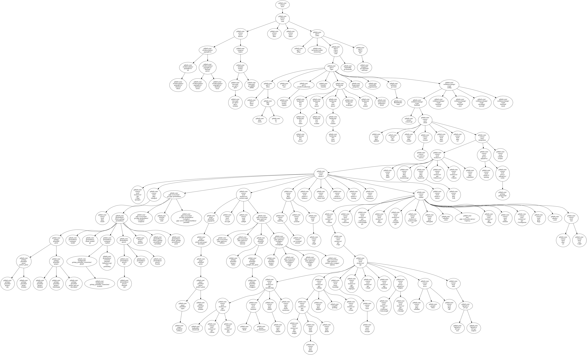

## mew
---
mew shows Go packages that used in your repo


### Usage

```shell
❯ mew -h
mew - Show your Go repo related pkgs

Usage:
  mew [flags]

Flags:
  -e, --ed stringArray   exclude the dir (default [vendor,.git])
  -d, --graph string     dump graphviz graph (default "mew.dot")
  -g, --grep string      grep the pkg list
  -h, --help             help for mew
      --json             show json format
  -r, --repo string      input repo name
```

### e.g.

```shell
❯ mew -r github.com/scbizu/mew -g 'github'  -e '.git' -e 'vendor' --json -d 'mew.dot'

["\"github.com/scbizu/mew/cmd\"","\"github.com/scbizu/mew/drawer\"","\"github.com/scbizu/mew/filter\"","\"github.com/scbizu/mew/linker\"","\"github.com/spf13/cobra\"","\"github.com/awalterschulze/gographviz\"","\"github.com/sirupsen/logrus\""]
```

it will generate the DOT file by [gographviz](https://github.com/awalterschulze/gographviz)

and then generate the PNG file by

```shell
dot -Tpng mew.dot -o mew.png
```


